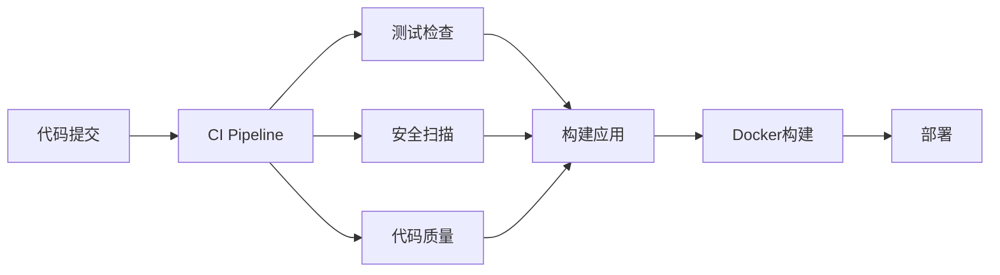

# 开发规范总览

## 📋 概述

本目录包含 CodeAS Backend 项目的完整开发规范，结合 GitHub 和 GitHub Actions MCP 集成，确保代码质量和开发效率。

## 📚 规范文档

### 核心规范

| 文档 | 描述 | 重要性 |
|------|------|--------|
| [Git 工作流规范](./git-workflow-standards.md) | Git 分支策略、提交规范、PR流程 | ⭐⭐⭐⭐⭐ |
| [代码编写规范](./code-standards.md) | Java代码规范、Spring Boot最佳实践 | ⭐⭐⭐⭐⭐ |
| [GitHub Actions 规范](./github-actions-standards.md) | CI/CD工作流规范、MCP集成 | ⭐⭐⭐⭐ |

### 模板文件

| 文件 | 位置 | 用途 |
|------|------|------|
| [PR模板](../../.github/pull_request_template.md) | `.github/pull_request_template.md` | Pull Request标准模板 |
| [Issue模板](../../.github/ISSUE_TEMPLATE/) | `.github/ISSUE_TEMPLATE/` | Issue报告模板 |

## 🚀 快速开始

### 1. 环境准备

```bash
# 克隆项目
git clone https://github.com/AkkoSpace/CodeAS-backend.git
cd CodeAS-backend

# 配置Git用户信息
git config user.name "Your Name"
git config user.email "your.email@example.com"

# 安装Git hooks
cp .githooks/* .git/hooks/
chmod +x .git/hooks/*
```

### 2. 开发流程

```bash
# 1. 创建功能分支
git checkout dev
git pull origin dev
git checkout -b feature/用户模块-登录功能

# 2. 开发代码
# ... 编写代码 ...

# 3. 提交代码（遵循gitmoji规范）
git add .
git commit -m ":sparkles: feat(auth): 实现用户登录功能"

# 4. 推送并创建PR
git push origin feature/用户模块-登录功能
# 在GitHub上创建Pull Request
```

### 3. MCP监控

使用GitHub Actions MCP实时监控CI/CD状态：

```bash
# 查看工作流状态
list_workflow_runs_Github_Action --owner AkkoSpace --repo CodeAS-backend

# 监控特定运行
get_workflow_run_jobs_Github_Action --owner AkkoSpace --repo CodeAS-backend --runId <run_id>
```

## 📊 提交规范速查

### Gitmoji + 类型映射

| Gitmoji | 类型 | 说明 | 示例 |
|---------|------|------|------|
| :sparkles: | feat | 新功能 | `:sparkles: feat(auth): 添加JWT认证` |
| :bug: | fix | 修复bug | `:bug: fix(db): 修复连接超时问题` |
| :memo: | docs | 文档 | `:memo: docs(api): 更新API文档` |
| :art: | style | 格式 | `:art: style: 优化代码格式` |
| :recycle: | refactor | 重构 | `:recycle: refactor(service): 重构用户服务` |
| :zap: | perf | 性能 | `:zap: perf(query): 优化查询性能` |
| :white_check_mark: | test | 测试 | `:white_check_mark: test(auth): 添加认证测试` |
| :construction_worker: | build | 构建 | `:construction_worker: build: 升级Maven插件` |
| :green_heart: | ci | CI | `:green_heart: ci: 优化GitHub Actions` |
| :wrench: | chore | 杂项 | `:wrench: chore: 更新配置文件` |

### 分支命名规范

```
feature/模块名-功能描述
fix/问题描述
hotfix/紧急修复描述
release/版本号
```

## 🔍 代码审查清单

### 提交前自检

- [ ] 代码符合编码规范
- [ ] 单元测试覆盖率 > 80%
- [ ] 所有测试通过
- [ ] 文档已更新
- [ ] Commit信息符合规范
- [ ] 分支命名正确

### 审查者检查

- [ ] 功能正确性
- [ ] 代码质量
- [ ] 性能影响
- [ ] 安全考虑
- [ ] 测试充分性
- [ ] 文档完整性

## 🛠️ 工具配置

### IDE设置

#### IntelliJ IDEA
```bash
# 导入代码格式配置
File → Settings → Editor → Code Style → Java
Import Scheme → Google Java Style
```

#### VS Code
```json
{
  "java.format.settings.url": "https://raw.githubusercontent.com/google/styleguide/gh-pages/eclipse-java-google-style.xml",
  "java.checkstyle.configuration": "${workspaceFolder}/checkstyle.xml"
}
```

### Git配置

```bash
# 全局配置
git config --global init.defaultBranch main
git config --global pull.rebase true
git config --global core.autocrlf input

# 项目配置
git config core.hooksPath .githooks
```

## 📈 CI/CD流程

### 工作流概览



### 状态监控

| 工作流 | 状态 | 说明 |
|--------|------|------|
| CI Pipeline |  | 主要构建流程 |
| Code Quality |  | 代码质量检查 |
| Security Scan |  | 安全扫描 |

## 🔧 故障排除

### 常见问题

#### 1. 提交信息格式错误
```bash
# 修改最后一次提交信息
git commit --amend -m ":sparkles: feat(auth): 正确的提交信息"
```

#### 2. CI检查失败
```bash
# 查看GitHub Actions日志
# 使用MCP工具监控状态
get_workflow_run_Github_Action --owner AkkoSpace --repo CodeAS-backend --runId <run_id>
```

#### 3. 代码格式问题
```bash
# 自动格式化代码
mvn fmt:format

# 检查代码风格
mvn checkstyle:check
```

#### 4. 测试失败
```bash
# 运行特定测试
mvn test -Dtest=UserServiceTest

# 生成测试报告
mvn surefire-report:report
```

## 📖 学习资源

### 官方文档

- [Google Java Style Guide](https://google.github.io/styleguide/javaguide.html)
- [Spring Boot Reference](https://docs.spring.io/spring-boot/docs/current/reference/html/)
- [GitHub Actions Documentation](https://docs.github.com/en/actions)
- [Conventional Commits](https://www.conventionalcommits.org/)

### 项目相关

- [项目架构文档](../architecture/README.md)
- [API文档](../api/README.md)
- [部署指南](../deployment/README.md)
- [环境变量配置](../guides/environment-variables.md)

## 🤝 团队协作

### 沟通渠道

- **代码审查**: GitHub Pull Request
- **问题讨论**: GitHub Issues
- **技术分享**: 团队会议
- **紧急问题**: 即时通讯工具

### 最佳实践

1. **小而频繁的提交** - 每个提交只包含一个逻辑变更
2. **及时同步** - 定期从主分支拉取最新代码
3. **主动沟通** - 遇到问题及时讨论
4. **知识分享** - 定期分享技术心得
5. **持续改进** - 定期回顾和优化流程

## 📝 更新日志

### 版本历史

- **v1.0.0** (2024-01-01) - 初始版本规范
- **v1.1.0** (2024-05-30) - 添加GitHub Actions MCP集成
- **v1.1.1** (2024-05-30) - 优化提交规范和PR模板

### 规范变更

所有规范变更都会在此记录，确保团队成员及时了解最新要求。

---

**遵循规范，提升效率！** 🚀

如有疑问或建议，请创建 [Issue](https://github.com/AkkoSpace/CodeAS-backend/issues) 讨论。
