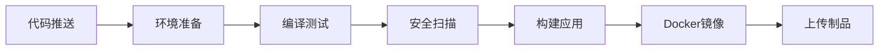
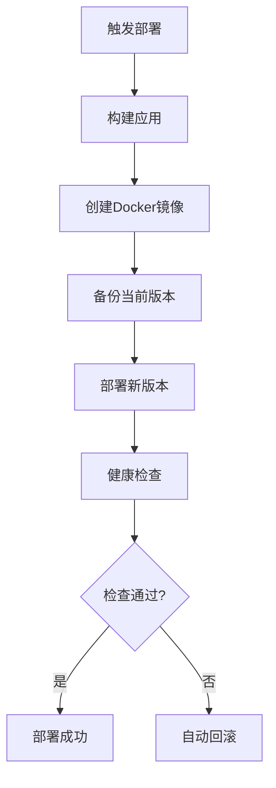

# GitHub功能配置总览

本文档总结了为CodeAS后端项目配置的所有GitHub功能和最佳实践。

## 🎯 配置概览

### ✅ 已配置的功能

| 功能类别 | 具体功能 | 状态 | 文件位置 |
|---------|---------|------|----------|
| **CI/CD** | 持续集成流水线 | ✅ 已配置 | `.github/workflows/ci.yml` |
| **CI/CD** | 自动化部署 | ✅ 已配置 | `.github/workflows/deploy.yml` |
| **代码质量** | SonarCloud集成 | ✅ 已配置 | `.github/workflows/code-quality.yml` |
| **安全扫描** | OWASP依赖检查 | ✅ 已配置 | `pom.xml` + workflows |
| **安全扫描** | Snyk漏洞扫描 | ✅ 已配置 | `.github/workflows/code-quality.yml` |
| **依赖管理** | Dependabot自动更新 | ✅ 已配置 | `.github/dependabot.yml` |
| **项目管理** | Issue模板 | ✅ 已配置 | `.github/ISSUE_TEMPLATE/` |
| **项目管理** | PR模板 | ✅ 已配置 | `.github/pull_request_template.md` |
| **测试覆盖** | JaCoCo + Codecov | ✅ 已配置 | `pom.xml` + workflows |
| **许可证** | 许可证合规检查 | ✅ 已配置 | `pom.xml` |

## 🚀 核心功能详解

### 1. 持续集成 (CI)
**自动触发条件：**
- 推送到 `main` 或 `dev` 分支
- 创建Pull Request

**执行内容：**


### 2. 持续部署 (CD)
**部署策略：**
- **Staging环境**：`dev`分支自动部署
- **Production环境**：手动触发部署

**部署流程：**


### 3. 代码质量监控
**质量指标：**
- 代码覆盖率 > 80%
- 代码重复率 < 3%
- 安全漏洞 = 0
- 代码异味 < 10

**工具集成：**
- **SonarCloud**：代码质量分析
- **Codecov**：测试覆盖率
- **JaCoCo**：Java代码覆盖率

### 4. 安全保障
**多层安全扫描：**
- **静态代码分析**：CodeQL + SonarCloud
- **依赖漏洞扫描**：OWASP + Snyk
- **Secret扫描**：GitHub原生功能
- **许可证合规**：License Maven Plugin

## 📋 使用指南

### 开发工作流

1. **创建功能分支**
   ```bash
   git checkout -b feature/new-feature
   ```

2. **开发和提交**
   ```bash
   git commit -m ":sparkles: feat: 添加新功能"
   ```

3. **推送并创建PR**
   ```bash
   git push origin feature/new-feature
   ```

4. **自动化检查**
   - CI流水线自动运行
   - 代码质量检查
   - 安全扫描

5. **代码审查和合并**
   - 团队成员审查代码
   - 所有检查通过后合并

### 部署流程

#### Staging部署（自动）
```bash
# 推送到dev分支即可自动部署
git push origin dev
```

#### Production部署（手动）
1. 在GitHub Actions页面
2. 选择"Deploy to Environment"
3. 选择"production"环境
4. 点击"Run workflow"

### 监控和维护

#### 查看构建状态
- GitHub Actions页面查看所有工作流
- README中的徽章显示构建状态

#### 代码质量报告
- SonarCloud仪表板
- Codecov覆盖率报告
- PR中的自动评论

#### 安全漏洞处理
- Dependabot自动创建安全更新PR
- Security页面查看漏洞详情
- 及时处理高危漏洞

## 🔧 配置要求

### 必需的Secrets配置

在GitHub仓库设置中添加以下Secrets：

```bash
# 代码质量
SONAR_TOKEN=your_sonarcloud_token

# 安全扫描
SNYK_TOKEN=your_snyk_token

# 部署配置
STAGING_SSH_KEY=your_staging_private_key
STAGING_HOST=staging.akko.space
STAGING_USER=deploy

PRODUCTION_SSH_KEY=your_production_private_key
PRODUCTION_HOST=api.akko.space
PRODUCTION_USER=deploy

# 通知
SLACK_WEBHOOK=your_slack_webhook_url
```

### 环境变量配置

```bash
# 应用URL
STAGING_URL=https://staging.akko.space
PRODUCTION_URL=https://api.akko.space
```

## 📊 效果预期

### 开发效率提升
- **自动化测试**：减少手动测试时间 80%
- **自动化部署**：部署时间从30分钟减少到5分钟
- **代码质量**：提前发现问题，减少生产bug 60%

### 安全性增强
- **依赖漏洞**：自动检测和修复
- **代码安全**：静态分析发现安全问题
- **合规性**：许可证自动检查

### 团队协作改善
- **标准化流程**：统一的开发和部署流程
- **可视化进度**：清晰的项目状态展示
- **自动化通知**：及时的状态更新

## 🎯 下一步计划

### 短期目标（1-2周）
- [ ] 配置SonarCloud账户
- [ ] 设置Slack通知
- [ ] 配置生产环境部署
- [ ] 创建GitHub Projects看板

### 中期目标（1个月）
- [ ] 集成性能测试
- [ ] 添加API文档自动生成
- [ ] 配置监控告警
- [ ] 优化构建速度

### 长期目标（3个月）
- [ ] 多环境部署策略
- [ ] 蓝绿部署
- [ ] 自动化回归测试
- [ ] 容器安全扫描

## 📚 相关文档

- [GitHub配置指南](../guides/GITHUB_SETUP.md)
- [开发指南](../guides/DEVELOPMENT_GUIDE.md)
- [部署指南](../deployment/DEPLOYMENT_GUIDE.md)
- [安全指南](../guides/SECURITY_GUIDE.md)

## 🤝 贡献指南

欢迎提交Issue和PR来改进GitHub配置：

1. **报告问题**：使用Bug Report模板
2. **功能建议**：使用Feature Request模板
3. **配置改进**：直接提交PR
4. **文档更新**：保持文档与配置同步

---

**注意**：首次使用需要配置相应的Secrets和环境变量，详细步骤请参考[GitHub配置指南](../guides/GITHUB_SETUP.md)。
